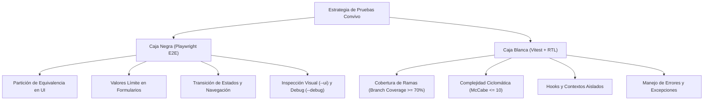

# Plan de Pruebas — Convivo Frontend

**Proyecto:** Convivo — SPA de Gestión para Condominios Residenciales  
**Estándar de referencia:** ISO/IEC/IEEE 29119-3 / IEEE 730  
**Stack de pruebas:**

- **Caja Negra (E2E / Sistema):** Playwright Test 1.58+ (`@playwright/test`)
- **Caja Blanca (Unitaria / Integración):** Vitest 5, React Testing Library 16, jsdom 30, @vitest/ui, @vitest/coverage-v8  
  **Fecha:** 25 de septiembre de 2026

---

## 1. Alcance y Objetivos

El objetivo de este plan de pruebas es garantizar la integridad, fiabilidad funcional, seguridad en el manejo de roles/sesiones y estabilidad de los componentes y flujos de usuario del frontend de Convivo.

### Objetivos Específicos:

- Validar el flujo de autenticación OAuth 2.0 PKCE con Google y AWS Cognito.
- Asegurar el control de acceso en rutas protegidas (`ProtectedRoute`) según el rol del usuario (`residente`, `conserje`, `admin`, `comite`).
- Validar la integración y resiliencia de la interfaz ante respuestas y errores HTTP del backend BFF.
- Mantener una cobertura de ramas mínima del 70% en componentes críticos y utilitarios de sesión.
- Validar flujos de usuario end-to-end simulando navegación real en navegadores modernos mediante **Playwright**.

---

## 2. Estrategia de Pruebas

Se aplica un enfoque híbrido que combina técnicas de **Caja Negra** (orientadas a especificación y comportamiento externo con Playwright) y **Caja Blanca** (orientadas a estructura de código y flujo de control con Vitest).

---

## 3. Pruebas de Caja Negra con Playwright (Black-Box Testing)

Las pruebas de caja negra evalúan las entradas y salidas del sistema sin inspeccionar la implementación interna, simulando acciones reales de residentes, administradores y conserjes en el navegador.

### 3.1 Partición de Equivalencia (Equivalence Partitioning)

| Dominio / Funcionalidad             | Clase Válida                                                        | Clases Inválidas                                                  | Verificación en Playwright                                                                             |
| :---------------------------------- | :------------------------------------------------------------------ | :---------------------------------------------------------------- | :----------------------------------------------------------------------------------------------------- |
| **Acceso a Rutas Protegidas**       | Usuario con rol permitido en sesión.                                | Usuario anónimo (`null`) o rol no autorizado.                     | Intento de navegación directa a `/residente` redirige automáticamente a `/login`.                      |
| **Páginas de Error (`AuthError`)**  | Parámetros `reason` esperados (`oauth_error`, `connection_failed`). | Parámetros vacíos o no tipificados.                               | Verifica que la interfaz no exponga infraestructura interna (sin textos de "Cognito" ni stack traces). |
| **Botones de Acción y Formularios** | Clic en elementos interactivos visibles.                            | Clic en botones deshabilitados o con carga activa (`isRetrying`). | El botón muestra estado de carga y previene dobles envíos.                                             |

### 3.2 Análisis de Valores Límite (Boundary Value Analysis - BVA)

| Parámetro                                 | Valor Límite Inferior | Valor Nominal                           | Valor Límite Superior  | Comportamiento Esperado                                                         |
| :---------------------------------------- | :-------------------- | :-------------------------------------- | :--------------------- | :------------------------------------------------------------------------------ |
| **Respuesta de Red (Latencia / Timeout)** | 0 ms (inmediata).     | 2500 ms (timeout de salud de servicio). | > 5000 ms (red caída). | Playwright intercepta rutas de red y valida el render del mensaje de reintento. |
| **Tamaño de Pantalla (Viewport)**         | 375px (Mobile).       | 768px (Tablet).                         | 1440px (Desktop).      | Verifica visibilidad del menú hamburguesa en mobile y barra lateral en desktop. |

### 3.3 Pruebas de Transición de Estados

| Estado Origen                  | Acción del Usuario                      | Estado Destino                | Aserción Playwright                                              |
| :----------------------------- | :-------------------------------------- | :---------------------------- | :--------------------------------------------------------------- |
| **Inicio (`/`)**               | Clic en "Iniciar sesión"                | Pantalla de Login (`/login`)  | `expect(page).toHaveURL(/.*login/)`                              |
| **Login (`/login`)**           | Clic en "Continuar con Google"          | Redirección OAuth Cognito     | Verifica intento de navegación hacia el dominio de autorización. |
| **Error Auth (`/auth/error`)** | Clic en "Volver al sitio principal"     | Inicio (`/`)                  | `expect(page).toHaveURL("/")`                                    |
| **Error Auth (`/auth/error`)** | Clic en "Reintentar" con servicio caído | Mensaje de Alerta en pantalla | `expect(page.getByRole("alert")).toBeVisible()`                  |

---

## 4. Pruebas de Caja Blanca con Vitest (White-Box Testing)

Las pruebas de caja blanca examinan la estructura interna, flujos de control, branches y caminos lógicos del código fuente.

### 4.1 Cobertura de Ramas y Decisiones

- **`src/auth/cognitoAuth.ts`**:
  - Función `roleFromClaims`: cobertura 100% de branches (claim con grupo válido, claim con grupo en mayúsculas/minúsculas, claim sin grupos, claim ausente).
  - Función `isCognitoConfigured`: branch con variables completas vs branch con variable faltante.
  - Función `checkCognitoReachability`: branch de éxito vs branch de `AbortController` / excepción de red.
- **`src/routes/ProtectedRoute.tsx`**:
  - Branch 1: `user == null` o `role == null` -> `<Navigate to="/login" />`.
  - Branch 2: `role != null` pero `!allowedRoles.includes(role)` -> `<Navigate to="/" />`.
  - Branch 3: rol autorizado -> `<Outlet />`.
- **`src/utils/authStorage.ts`**:
  - Branch de lectura desde `sessionStorage` (v1) vs fallback de migración desde `localStorage` (legacy) vs storage nulo.
  - Branch de ejecución en servidor (`window === undefined`) vs ejecución en navegador.

### 4.2 Métricas de Complejidad Ciclomática (McCabe)

- Umbral máximo permitido: **M ≤ 10** por función.
- Control de anidamiento y refactorización a promesas planas:
  - `handleRetry` en [`src/pages/AuthError.tsx`](../pages/AuthError.tsx): cadena de promesas plana `.then().catch()` sin sentencias `throw` dentro de bloques `try/catch`, garantizando 100% de compatibilidad con React Compiler.

---

## 5. Comandos de Ejecución: `-ui` y `-debug`

El proyecto dispone de scripts integrados en `package.json` para ejecutar las pruebas tanto en Playwright (Caja Negra E2E) como en Vitest (Caja Blanca Unitaria):

### 5.1 Comandos Playwright (Caja Negra)

| Modo                      | Comando npm              | Comando npx directo           | Propósito                                                                                              |
| :------------------------ | :----------------------- | :---------------------------- | :----------------------------------------------------------------------------------------------------- |
| **Headless (CI)**         | `npm run test:e2e`       | `npx playwright test`         | Ejecución desatendida en background para pipelines.                                                    |
| **Modo UI (`-ui`)**       | `npm run test:e2e:ui`    | `npx playwright test --ui`    | Abre la interfaz gráfica interactiva de Playwright con time-travel, visor DOM y snapshots paso a paso. |
| **Modo Debug (`-debug`)** | `npm run test:e2e:debug` | `npx playwright test --debug` | Abre el Playwright Inspector con pausa por paso, selector interactivo y consola de depuración en vivo. |

### 5.2 Comandos Vitest (Caja Blanca)

| Modo                      | Comando npm          | Comando npx directo                              | Propósito                                                                    |
| :------------------------ | :------------------- | :----------------------------------------------- | :--------------------------------------------------------------------------- |
| **Ejecución única**       | `npm run test`       | `npx vitest run`                                 | Ejecuta las pruebas unitarias y de integración de componentes.               |
| **Modo UI (`-ui`)**       | `npm run test:ui`    | `npx vitest --ui`                                | Dashboard web de Vitest para inspeccionar tests, tiempos y árbol de módulos. |
| **Modo Debug (`-debug`)** | `npm run test:debug` | `npx vitest --inspect-brk --no-file-parallelism` | Pausa en el primer breakpoint para depuración con Chrome DevTools o VS Code. |
| **Cobertura**             | `npm run coverage`   | `npx vitest run --coverage`                      | Reporte detallado de cobertura de líneas, ramas y funciones.                 |

---

## 6. Matriz de Trazabilidad de Pruebas

| Requisito / Componente                  | Archivo de Prueba                      | Framework    | Tipo de Prueba            | Técnica Aplicada                                                  |
| :-------------------------------------- | :------------------------------------- | :----------- | :------------------------ | :---------------------------------------------------------------- |
| **Flujos de Usuario E2E**               | `tests/e2e/app.spec.ts`                | Playwright   | Caja Negra (E2E)          | Partición de equivalencia, navegación visual, BVA de red.         |
| **Cognito OAuth + PKCE**                | `tests/lib/cognitoAuth.test.ts`        | Vitest + RTL | Caja Blanca               | BVA, Transición de estados, Cobertura de branches.                |
| **Control de Rutas (`ProtectedRoute`)** | `tests/routes/ProtectedRoute.test.tsx` | Vitest + RTL | Caja Blanca / Integración | Partición de equivalencia (autorizado / no autorizado / anónimo). |
| **Gestión de Sesión (`AuthProvider`)**  | `tests/hooks/AuthProvider.test.tsx`    | Vitest + RTL | Caja Blanca               | Persistencia, limpieza de storage, fallback v1/legacy.            |
| **Página de Error (`AuthError`)**       | `tests/pages/AuthError.test.tsx`       | Vitest + RTL | Caja Blanca / UI          | Parámetros URL, reintentos y promesas.                            |
| **Servicio de Gastos (`gastosApi`)**    | `tests/services/gastosApi.test.ts`     | Vitest       | Caja Blanca / Integración | Mocking de fetch, cálculo de estados.                             |

---

## 7. Criterios de Aceptación y Salida

- **100% de pruebas en verde** en Vitest (34/34 tests) y Playwright.
- **Cobertura de ramas ≥ 70%** en código de lógica de negocio y autenticación.
- **Typecheck limpio** (`tsc --noEmit` con 0 errores).
- **Linter limpio** (`eslint .` con 0 errores).
- **React Doctor Score = 100/100** (0 problemas reportados).
